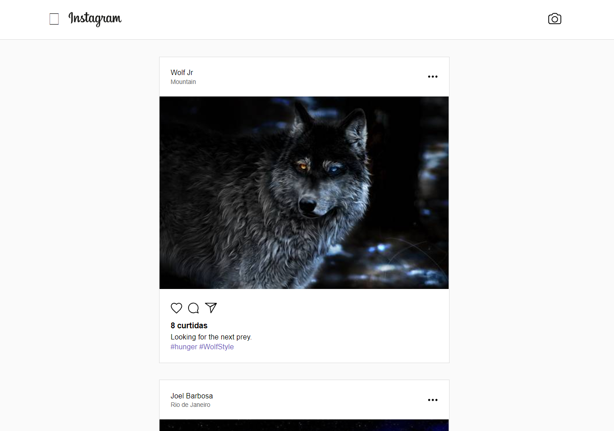
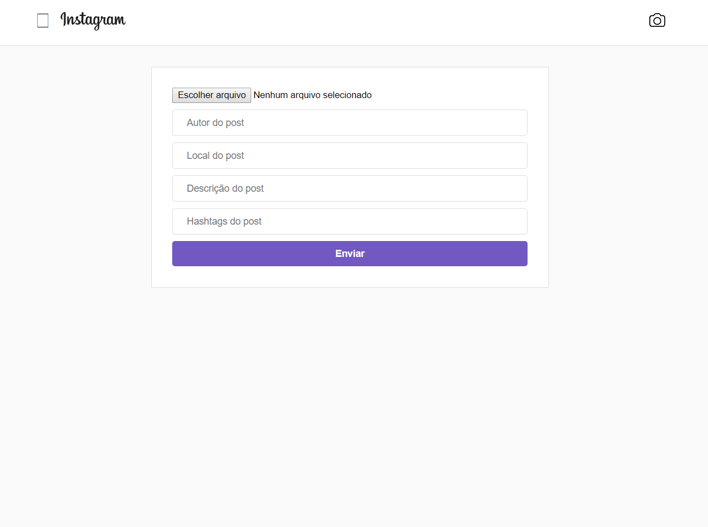

# Instagram Clone 📷

## Imagens: 📷

### <strong>Feed:</strong>

### <strong>Adicionar imagem:</strong>

## Sobre o projeto: 📃

O objetivo era desenvolver um clone da interface do aplicativo web do Instagram com o React.js, cronsumindo uma API construida com Node.Js.

## Requisitos do projeto: ✅
* Feed
  
Como página incial, para exibir as imagens que fossem adicionadas recentementes, com atualização em tempo real.

* Adicionar imagens

Uma página contendo um formulário para incluir novas fotos, com nome do autor, localidade, descrição da foto e hashtags.

## Frameworks e Tecnologias Utilizadas: 🌌
### Front-End: 🎨

* <strong>CSS</strong> (Estilização)
* <strong>React Js</strong> (Criação da Interface)
* <strong>React Router</strong> (Paginação)
* <strong>Axios</strong> (Requisições Ajax)
